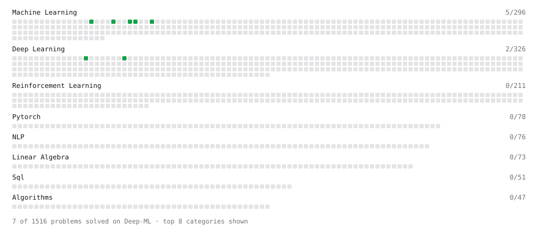

# Deep-ML

My machine learning practice from [Deep-ML](https://www.deep-ml.com). Every solution here was written by hand.

**8** solved · 8 problems · 0 labs · 0 math

[**Browse the interactive portfolio**](https://asaraiya7.github.io/deep-ml/) to replay this filling in over time.

## Problems

| | Difficulty | Solved | |
| --- | --- | --- | --- |
| [Calculate Accuracy Score](https://www.deep-ml.com/problems/36) | easy | 2026-10-04 | [solution](problems/0036-calculate-accuracy-score) |
| [Calculate Root Mean Square Error (RMSE)](https://www.deep-ml.com/problems/71) | easy | 2026-10-04 | [solution](problems/0071-calculate-root-mean-square-error-rmse) |
| [Implement a Simple Residual Block with Shortcut Connection](https://www.deep-ml.com/problems/113) | easy | 2026-10-07 | [solution](problems/0113-implement-a-simple-residual-block-with-shortcut-connection) |
| [Implement F-Score Calculation for Binary Classification](https://www.deep-ml.com/problems/61) | easy | 2026-10-04 | [solution](problems/0061-implement-f-score-calculation-for-binary-classification) |
| [Implement Precision Metric](https://www.deep-ml.com/problems/46) | easy | 2026-10-04 | [solution](problems/0046-implement-precision-metric) |
| [Implement Recall Metric in Binary Classification](https://www.deep-ml.com/problems/52) | easy | 2026-10-04 | [solution](problems/0052-implement-recall-metric-in-binary-classification) |
| [Implement the Hard Sigmoid Activation Function](https://www.deep-ml.com/problems/96) | easy | 2026-10-05 | [solution](problems/0096-implement-the-hard-sigmoid-activation-function) |
| [KL Divergence Between Two Normal Distributions](https://www.deep-ml.com/problems/56) | easy | 2026-10-07 | [solution](problems/0056-kl-divergence-between-two-normal-distributions) |

---

_This file is regenerated by Deep-ML on every push._
